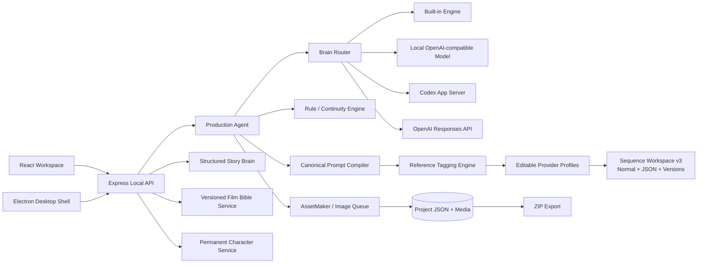
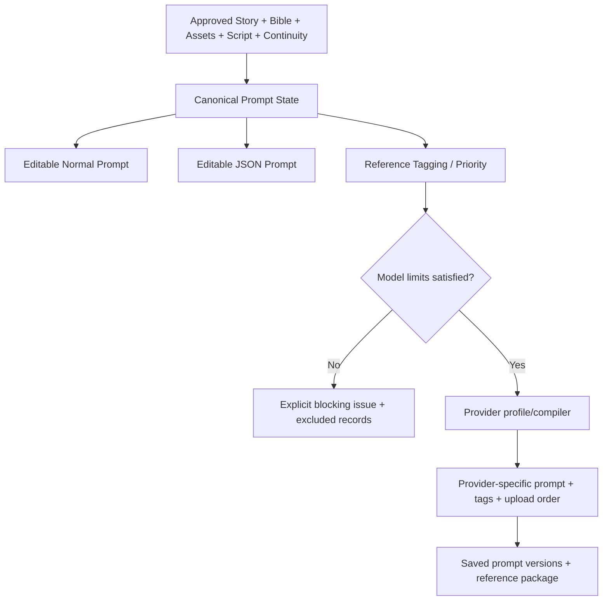

# Architecture

## Frontend

React/TypeScript renders project creation, agent control, Visual Movie DNA, reference setup/library, Story v2, Film Bible, character analysis/states, the Asset Manifest and Image Asset Library, Full Script v2, scenes, storyboard, sequence/frame planning, Sequence Workspace v3, continuity, rules, export, settings, diagnostics, and About. It communicates only with the local Express server.

## Backend and persistence

Express validates requests with Zod. `ProjectStore` owns safe project paths, atomic JSON writes, Markdown artifacts, binary media, migration backups, and ZIP export. v1.1.0 uses a schema-versioned local document database represented by typed project JSON and related registry files; it does not require SQL.

## Agents and rule engine

`ProductionAgent` supervises eight ordered phases and specialist definitions. `FilmRuleEngine` registers permanent entities, applies 53 structured rules, manages approval/locks, builds START/MID/END continuity, and blocks unsafe prompt generation. Brain providers implement one phase interface; they do not own duplicate workflows.

`StoryBrain` owns structured narrative state and downstream contracts. `FilmBibleService` consumes only the approved Story snapshot plus locked Movie DNA, routes generation through the central Brain Router, and preserves approved/locked versions when a new draft is generated or edited. Character analysis links Story candidate IDs to one permanent identity, protected references, adaptive sheet views, and sequence-level state records. The integrated filmmaking knowledge source contributes durable production rules without overriding project approvals or Platform Profiles.

## Reference and asset systems

`ReferenceManager` validates image type/size/magic, copies protected sources, assigns roles/usage, and enforces the required main-character source. `AssetMaker` creates provider-independent jobs, master images, adaptive sheet views, lineage, scene assets, and storyboard frames. Dependency edges stop a scene when a required visual is missing.

Duplicate scene protection compares dependency compositions. Unchanged compositions reuse the scene entity; changed compositions clear current pointers, increment version, and invalidate dependent storyboard frames while retaining job/lineage history.

## Sequence Workspace, Prompt Compiler, and adapters

Stable IDs such as `CHAR_MAIN_001` belong to the project. Tags such as `@Image 1` belong only to one provider request. The Prompt State renders both Normal and JSON forms, stores manual overrides, validates JSON, and persists profile-specific versions. Editable profiles own model duration, reference, audio, and syntax capabilities; critical references are never silently dropped.

The active asset store is deliberately flat: `assets/NNN_Name.ext`. `NNN` is monotonically allocated and is never reused or renumbered. Category, role, approval, lock, version, and sequence usage live in `assets/asset_manifest.json` and the production database. Generated candidates, retained versions, and migrated legacy category trees live under `asset_history/`. Sequence packages assign their own two-digit upload order and carry a versioned manifest that maps those temporary files and provider tags back to the permanent number, filename, and Asset ID.

Seedance, Higgsfield, MiniMax, Veo, Kling, Runway, Sora, and Custom are manual-handoff Platform Profiles in v1.1.0. Their presence does not imply a direct provider video API.

## Generation queue

Image jobs contain target, provider/model, prompts, source paths, dimensions, cost estimate, paid approval, attempt, status, result, thumbnail, and error. The included local renderer is free. Future paid adapters must leave `approvedToSpend=false` until explicit approval.

## Security boundaries

Renderer isolation is enabled in Electron; untrusted navigation is blocked. Project IDs and media paths are validated under the project root. Uploaded originals are not overwritten. Secrets belong in ignored `.env` or the provider credential system. Local projects, media, logs, builds, credentials, and databases are ignored from Git.

For file-level details see [docs/ARCHITECTURE.md](docs/ARCHITECTURE.md).

The approved production-domain architecture, staged implementation status, and completion gates are maintained in [docs/FINAL_ARCHITECTURE_AND_IMPLEMENTATION_CHECKLIST.md](docs/FINAL_ARCHITECTURE_AND_IMPLEMENTATION_CHECKLIST.md).
