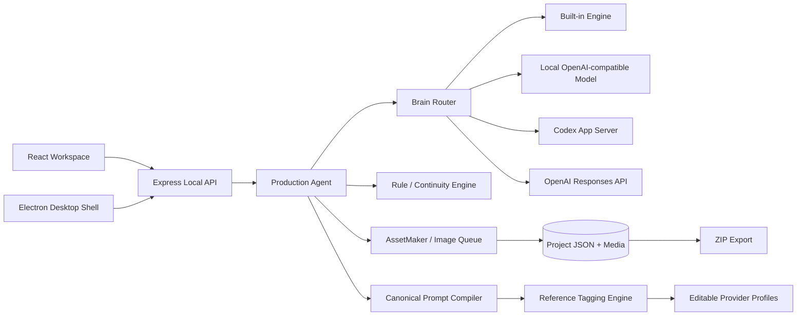
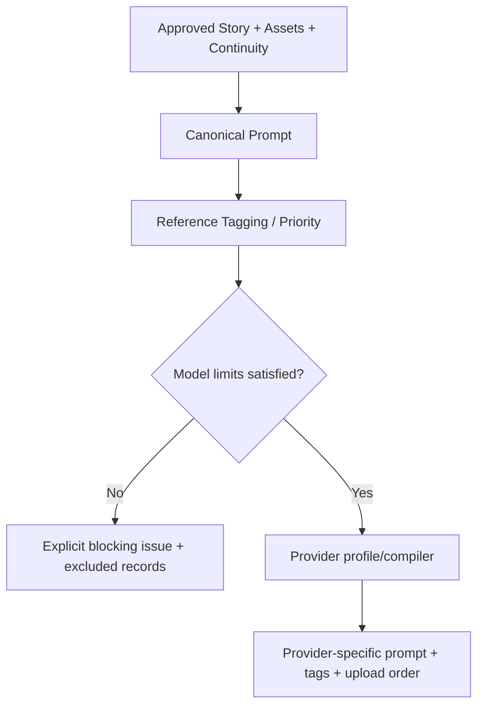

# Architecture

## Frontend

React/TypeScript renders project creation, agent control, reference setup/library, Story, Film Bible, asset categories, scenes, storyboard, sequence/frame planning, prompt compiler, continuity inspector, rules, generation ledger, export, settings, diagnostics, and About. It polls only the local Express server.

## Backend and persistence

Express validates requests with Zod. `ProjectStore` owns safe project paths, atomic JSON writes, Markdown artifacts, binary media, migration backups, and ZIP export. v1.0.0 uses a local document database represented by typed project JSON and related registry files; it does not require SQL.

## Agents and rule engine

`ProductionAgent` supervises eight ordered phases and specialist definitions. `FilmRuleEngine` registers permanent entities, applies 53 structured rules, manages approval/locks, builds START/MID/END continuity, and blocks unsafe prompt generation. Brain providers implement one phase interface; they do not own duplicate workflows.

## Reference and asset systems

`ReferenceManager` validates image type/size/magic, copies protected sources, assigns roles/usage, and enforces the required main-character source. `AssetMaker` creates provider-independent jobs, master images, adaptive sheet views, lineage, scene assets, and storyboard frames. Dependency edges stop a scene when a required visual is missing.

Duplicate scene protection compares dependency compositions. Unchanged compositions reuse the scene entity; changed compositions clear current pointers, increment version, and invalidate dependent storyboard frames while retaining job/lineage history.

## Prompt Compiler and adapters

Stable IDs such as `CHAR_MAIN_001` belong to the project. Tags such as `@Image 1` belong only to one provider request. Editable profiles contain model capabilities and limits; critical references are never silently dropped.

## Generation queue

Image jobs contain target, provider/model, prompts, source paths, dimensions, cost estimate, paid approval, attempt, status, result, thumbnail, and error. The included local renderer is free. Future paid adapters must leave `approvedToSpend=false` until explicit approval.

## Security boundaries

Renderer isolation is enabled in Electron; untrusted navigation is blocked. Project IDs and media paths are validated under the project root. Uploaded originals are not overwritten. Secrets belong in ignored `.env` or the provider credential system. Local projects, media, logs, builds, credentials, and databases are ignored from Git.

For file-level details see [docs/ARCHITECTURE.md](docs/ARCHITECTURE.md).
