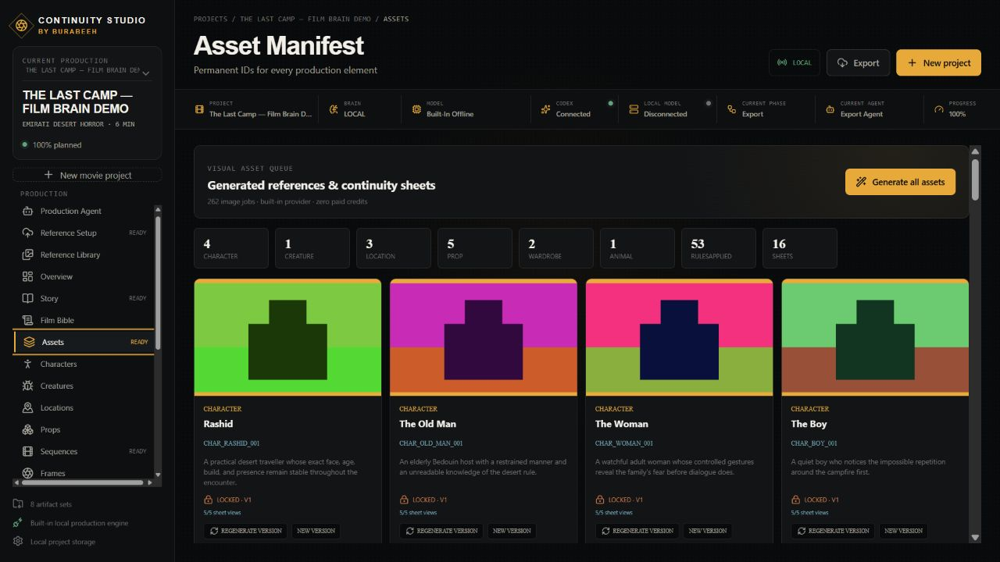
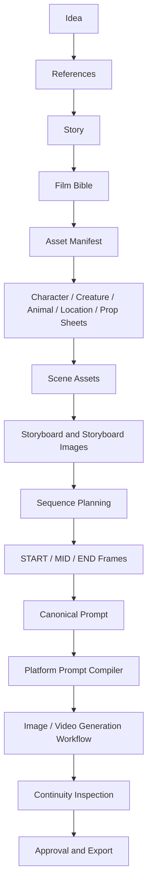
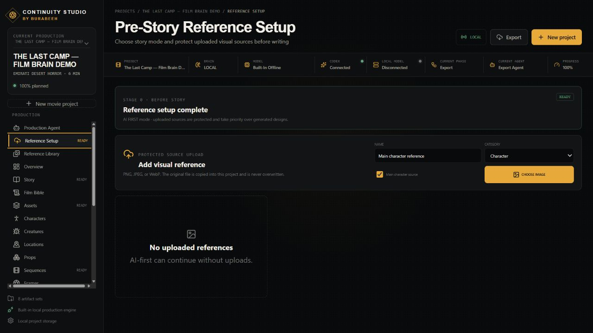
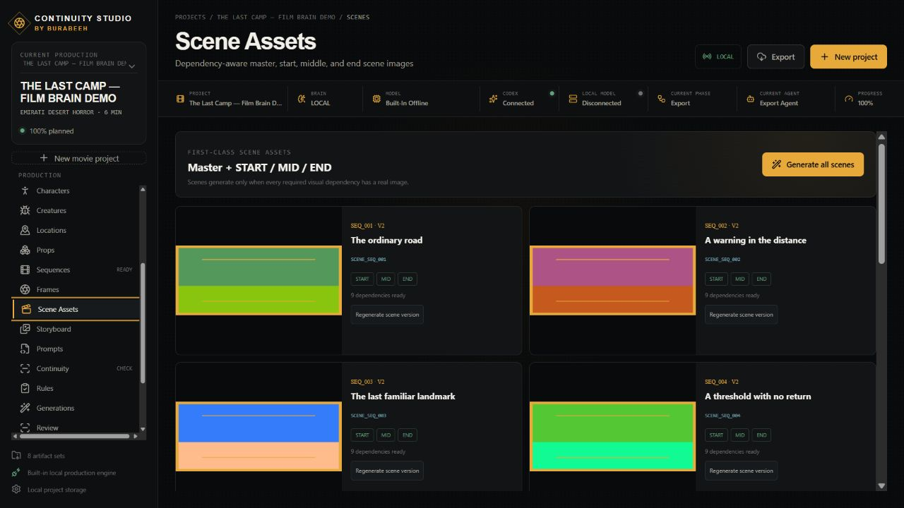
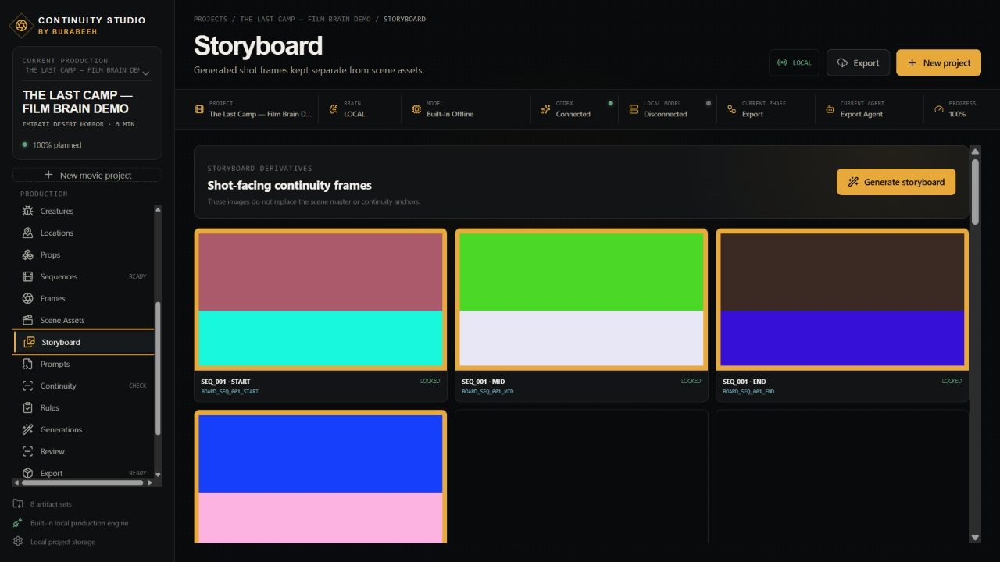
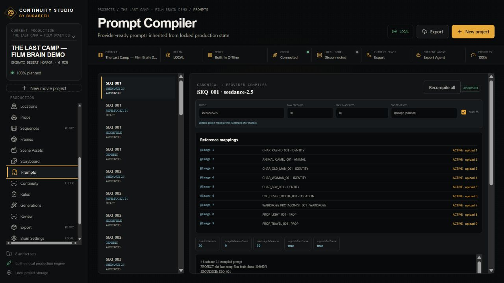
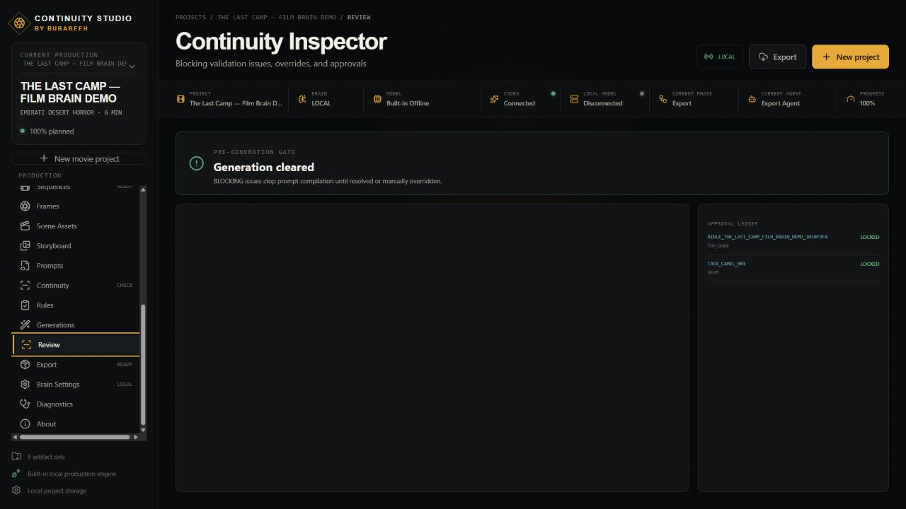

# Continuity Studio

Created by **Mohammed Al Marzooqi**, **Burabeeh**, United Arab Emirates.

[English](README.md) · [العربية](README.ar.md) · [Español](README.es.md) · [中文](README.zh-CN.md)

Continuity Studio is an open-source AI filmmaking production and continuity workspace. It turns one movie idea into a persistent, inspectable project containing story development, film rules, visual asset records, continuity sheets, scene assets, storyboard frames, provider-ready prompts, validation, and export files.

The central goal is simple: **characters, wardrobe, props, animals, locations, geography, lighting, and damage should remain consistent across an AI-assisted production.**



## Production workflow



## What works in v1.0.0

- Full automatic and phase-by-phase production modes.
- AI-first, reference-first, and hybrid story setup.
- Protected user reference uploads and a permanent main-character source.
- Story Engine, Film Bible, 53-rule Film Brain, and structured continuity states.
- Permanent asset IDs, relationship graph, lineage, approvals, locks, and versions.
- Real local PNG previsual generation jobs for asset masters and adaptive continuity sheets.
- Dependency-gated scene masters with START, MID, and END images.
- Storyboard frame entities and images kept separate from scene masters.
- Canonical prompt representation and editable provider model profiles.
- Seedance 2.5, MiniMax S2V-01, Higgsfield, and Generic **manual prompt compilation/export**.
- Explicit provider reference mappings; critical identity references are never silently discarded.
- Built-in offline production engine, optional OpenAI-compatible local model, Codex App Server supervision, and optional OpenAI text generation.
- Local JSON/Markdown/media project storage and ZIP export.
- Windows installer and portable desktop package.

## Provider status

| Provider | Current support | Credentials |
| --- | --- | --- |
| Built-in local engine | Working story/planning pipeline and zero-cost PNG previsual renderer | None |
| OpenAI API | Working text-phase provider through the OpenAI Responses API | `OPENAI_API_KEY` |
| Codex | Working supervision through Codex App Server sign-in | ChatGPT/Codex sign-in |
| OpenAI-compatible local models | Working optional text provider | Local server URL/model |
| Seedance 2.5 | Prompt compilation, reference tags, validation, manual export | No direct generation API in v1.0.0 |
| MiniMax S2V-01 | Prompt compilation, reference selection, validation, manual export | No direct generation API in v1.0.0 |
| Higgsfield | Prompt compilation/reference plan and manual export | No direct generation API in v1.0.0 |
| Generic image/video providers | Provider interfaces and canonical export boundary | Adapter required |
| KimiBrain | Documented future provider; not integrated | Not applicable |

No provider listed above sponsors, endorses, owns, or officially partners with Continuity Studio.

## Install

### Windows release

Download the installer or portable executable from [GitHub Releases](https://github.com/momorzq-oss/Continuity-Studio/releases). Windows packages are currently unsigned, so SmartScreen may show the standard unknown-publisher warning.

### Source and multilingual CLI setup

Requirements: Node.js 20.19+ (Node.js 22 LTS recommended), npm 10+, and Git for cloning. Python, FFmpeg, and an external database are **not required** by v1.0.0.

```bash
git clone https://github.com/momorzq-oss/Continuity-Studio.git
cd Continuity-Studio
npm run setup
```

The installer prompts are available in four languages:

```bash
npm run setup -- --lang en   # English
npm run setup -- --lang ar   # العربية
npm run setup -- --lang es   # Español
npm run setup -- --lang zh   # 中文
```

Then run `npm run desktop:dev`. See [Installation](INSTALLATION.md) and [Quick Start](QUICK_START.md).

## Screenshots

| Workspace | Preview |
| --- | --- |
| Reference setup |  |
| Asset and continuity sheets |  |
| Scene assets |  |
| Storyboard |  |
| Platform prompt compiler |  |
| Continuity inspector |  |

All screenshots use the fictional “The Last Camp” demonstration project and contain no private uploads or personal project data.

See the [complete screenshot gallery](docs/SCREENSHOTS.md) for project creation, Production Agent, story, characters, sequences, provider settings, export, and About screens.

## Documentation

- [Installation](INSTALLATION.md) · [Quick Start](QUICK_START.md) · [User Guide](USER_GUIDE.md)
- [English, Arabic, Spanish, and Chinese documentation index](docs/LANGUAGES.md)
- [Platforms and provider limitations](PLATFORMS.md)
- [Architecture](ARCHITECTURE.md) · [Provider development](docs/PROVIDER_DEVELOPMENT.md)
- [Main Character Tutorial](docs/MAIN_CHARACTER_TUTORIAL.md)
- [Asset Tutorial](docs/ASSET_TUTORIAL.md) · [Scene Tutorial](docs/SCENE_TUTORIAL.md)
- [Complete Movie Tutorial](docs/COMPLETE_MOVIE_TUTORIAL.md)
- [Troubleshooting](TROUBLESHOOTING.md) · [Roadmap](ROADMAP.md)
- [Contributing](CONTRIBUTING.md) · [Security](SECURITY.md) · [Code of Conduct](CODE_OF_CONDUCT.md)

## Provider-independent identity

Continuity Studio owns stable IDs such as `CHAR_RASHID_001`. A platform compiler may temporarily map that ID to `@Image 1`, “Reference image 1,” or another provider-specific label. The permanent identity never changes:

```text
Canonical Prompt → Provider Adapter → Provider-Specific Prompt
CHAR_RASHID_001  → Seedance         → @Image 1
```

## Development checks

```bash
npm run typecheck
npm test
npm run build
```

## About the creator

Mohammed Al Marzooqi, known online as Burabeeh, is an Emirati AI creator, independent filmmaker, software experimenter, and technology enthusiast from the United Arab Emirates. Continuity Studio grew from his experience solving identity, reference, scene, storyboard, prompt, and continuity problems in AI-assisted filmmaking. Read the [full biography](docs/ABOUT_BURABEEH.md).

## License

Copyright 2026 Mohammed Al Marzooqi. Licensed under the [Apache License 2.0](LICENSE).

## Credits

Continuity Studio uses TypeScript, React, Express, Electron, Vite, Vitest, the OpenAI SDK, and Codex packages. It can format manual workflows for Seedance, MiniMax, and Higgsfield. These names identify compatible technology formats only and do not imply sponsorship or endorsement.
