# Continuity Studio By BURABEEH

[](https://github.com/momorzq-oss/Continuity-Studio/actions/workflows/ci.yml)
[](https://github.com/momorzq-oss/Continuity-Studio/releases)
[](LICENSE)

Created by **Mohammed Al Marzooqi (BURABEEH)** in the United Arab Emirates.

[English](README.md) · [العربية](README.ar.md) · [Español](README.es.md) · [中文](README.zh-CN.md)

Continuity Studio By BURABEEH is a local-first AI filmmaking production workspace. It turns one movie idea into structured, inspectable production records: visual direction, Story, Film Bible, characters, reference images, assets, screenplay, timed sequences, shot plans, continuity state, and provider-ready prompts.

The application is designed around one difficult production problem: keeping **identity, wardrobe, props, creatures, animals, vehicles, locations, geography, lighting, camera language, dialogue, and physical state consistent from one sequence to the next**.

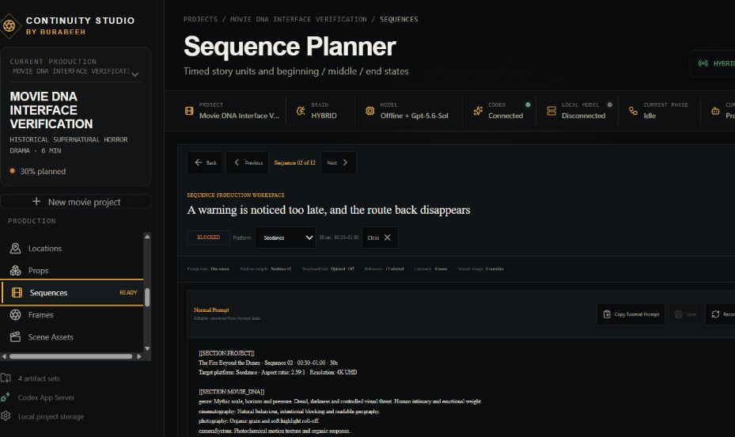

## Current release: v1.1.0

v1.1.0 is a production-planning and prompt-compilation release. The current source build adds a restart-safe **Automatic Movie** director, generated-video import, attempt history, manual review decisions, approved End State transfer, the movie progress dashboard, and complete project export. Direct provider video generation, automated visual inspection of video pixels, and final movie assembly remain roadmap work and are not presented as finished features.

### Working now

- Automatic Movie and Manual Guided modes using one compatible project format, approval system, mode switching, and restart-safe local persistence.
- Project Setup for runtime, sequence duration, delivery format, language, rating, audio options, and production preferences.
- Visual Movie DNA with **27 categories and 629 selectable options**, previews, comparisons, custom directions, version history, a permanent master frame, and downstream invalidation.
- Integrated AI Filmmaking Visual Guide principles for identity locks, neutral character sheets, unique reference numbering, concise prompts, storyboard continuity, and reference-aware video prompting.
- Story v2 with AI First, Reference First, and Hybrid creation; Full Story, Story Structure, Timeline, Character Arcs, and exact Sequence Breakdown views.
- Film Bible, Character Analysis, protected main-character references, adaptive character sheets, and per-sequence character states.
- Flat, permanently numbered Project Image storage, a numbered Asset Manifest, Image Asset Library, asset inspection, targeted prompt editing, versions, approvals, and locks.
- Full Script v2 with screenplay, dialogue-only, shot-script, production-script, scene, and sequence views.
- Sequence Workspace v3 with Previous/Next navigation, editable Normal Prompt and JSON Prompt, live canonical state, validation, saved versions, optional Storyboard Grid, and persistence.
- Versioned platform profiles for Seedance, Higgsfield, MiniMax, Veo, Kling, Runway, Sora, and Custom without hard-coding one provider's limits globally.
- Stable reference IDs, provider-specific `@Image` numbering, upload order, reference slot mapping, and downloadable sequence reference packages.
- Generated-video import with sequence, platform, prompt/JSON version, references, attempt, date, filename, and duration metadata; preserved rejection history; approval locks; and automatic approved End State to next Start State transfer.
- A movie progress dashboard for approved, ready, blocked, rejected, waiting, missing-asset, prompt-warning, and continuity-warning totals.
- Film Brain rules, Continuity Ledger, Audio Bible, Production Agent, diagnostics, local JSON/Markdown/media storage, and ZIP export.
- Built-in offline planning and deterministic PNG previsuals, optional Codex supervision, optional OpenAI text generation, and optional OpenAI-compatible local text models.

## Production workflow

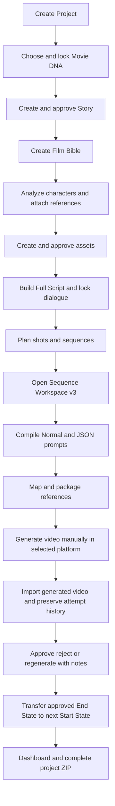

See the detailed [production workflow](docs/WORKFLOW.md) and [user guide](docs/USER_GUIDE.md).

## Automatic Movie mode

Choose **AUTOMATIC MOVIE**, enter an optional title, one movie brief, approximate runtime, languages, and a Main Character preference, then select **CREATE MY MOVIE**. Studio Brain selects global Movie DNA and a compatible versioned Platform Profile, develops the Story and Film Bible, analyses characters, and stops at the required protected Main Character checkpoint.

At the checkpoint, upload a JPG, JPEG, PNG, or WEBP identity source and create its neutral character sheet, or choose **GENERATE MAIN CHARACTER WITH AI**. The original upload remains protected and separate from generated sheets. Automatic Production Director then resumes the existing asset, production-memory, Audio Bible, Full Script, Dialogue Lock, Shot Planner, Sequence Planner, Prompt State, reference-mapping, and reference-package services. It does not use a second filmmaking engine.

Every completed stage and Studio Brain decision is saved to `project.json`. **Pause**, **Resume**, **Stop**, and **Manual Override** preserve completed work. If the backend closes during an active automatic run, the next launch continues from the first incomplete persisted stage. Asset generation has a maximum of three automatic attempts; important failures pause with **NEEDS USER REVIEW**, while unrelated work remains preserved.

## Manual Guided mode

Choose **MANUAL PRODUCTION** to open **DESCRIBE YOUR MOVIE**. Enter an optional title, one brief description, approximate duration, language, dialogue language, and an optional preferred platform. Select **NEXT**. Studio Brain pre-fills Project Setup and recommends editable Genre, combined genre, Cinematic Style, Photography, Camera, Lens, Color Grade, Lighting, Image Feel, Period, Environment, aspect ratio, sequence duration, audio, and Platform Profile settings.

Manual Mode never automatically approves those recommendations. A persistent 14-stage progress bar explains the current step, why it matters, what is recommended, what is required, and what comes next. Use **BACK**, **SAVE**, **NEXT**, **APPROVE AND NEXT**, or **LOCK AND NEXT** to move through the existing production screens. Missing requirements disable NEXT with a specific explanation. Reopening the app shows **CONTINUE WHERE YOU LEFT OFF** with **RESUME** and **VIEW PROJECT**. Manual and Automatic Mode can be switched at any time without restarting or converting project data.

## Permanent Project Image storage

Every active production image has one permanent number, ID, three-digit filename, and flat path such as `assets/007_Bedouin_Camp.png`. Categories are metadata, not storage folders. Regeneration stages candidates under `asset_history/`, then replaces the contents of the same active filename only after acceptance; its number, filename, ID, approvals, locks, sequence usage, and prompt relationships do not change.

Sequence packages use separate temporary upload numbering. For example, Project Images `002`, `005`, `007`, and `008` can become `@Image 1` through `@Image 4` with package files `01_Name.ext` through `04_Name.ext`. Each package includes `prompt.txt`, `prompt.json`, and `reference_manifest.json`, which maps every temporary position back to its permanent Project Image identity.

## Screenshots

All screenshots are from the real local v1.1.0 application using fictional verification projects. They contain no personal reference uploads.

| Workspace | Current build |
| --- | --- |
| Project Setup | 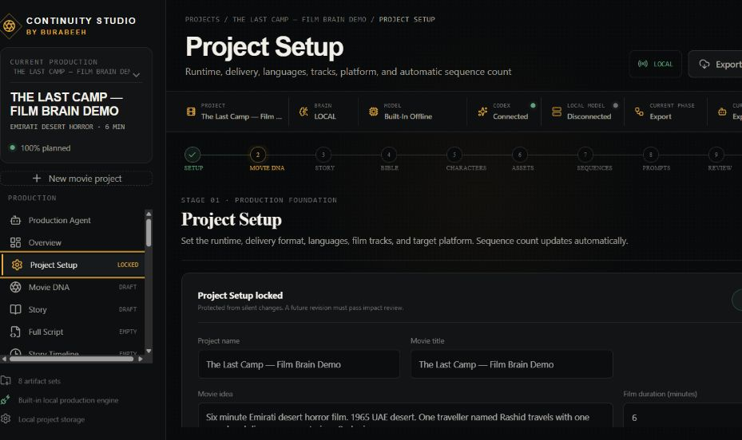 |
| Visual Movie DNA | 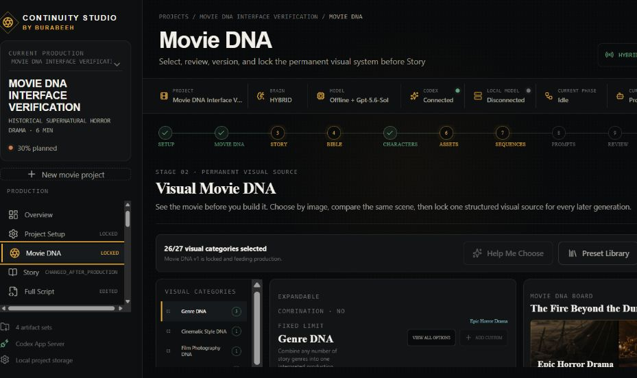 |
| Story v2 | 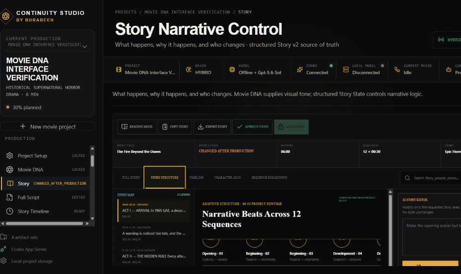 |
| Character States | 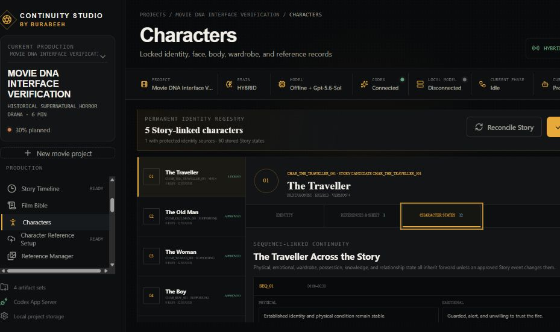 |
| Asset Library | 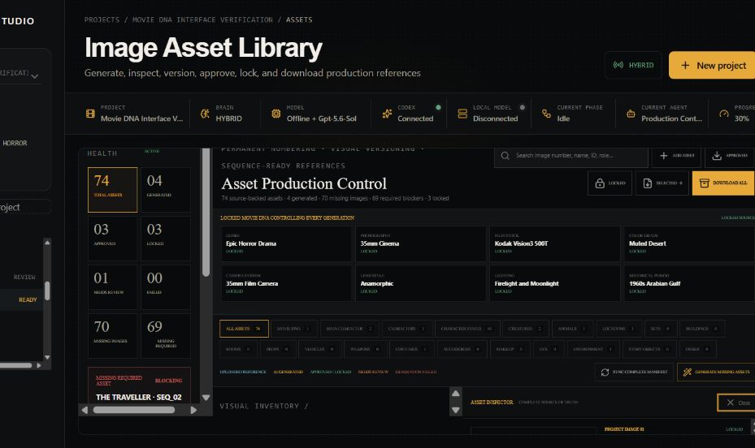 |
| Full Screenplay | 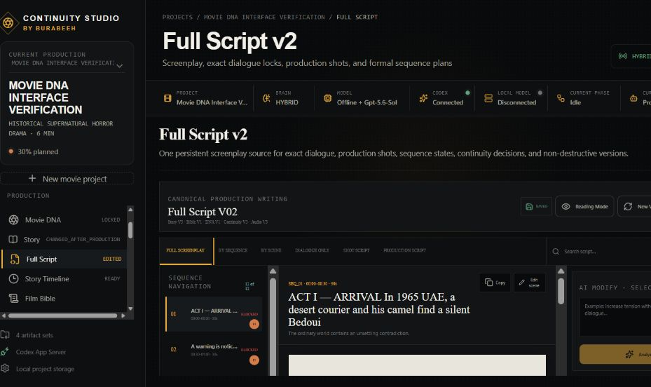 |
| Sequence Planner | 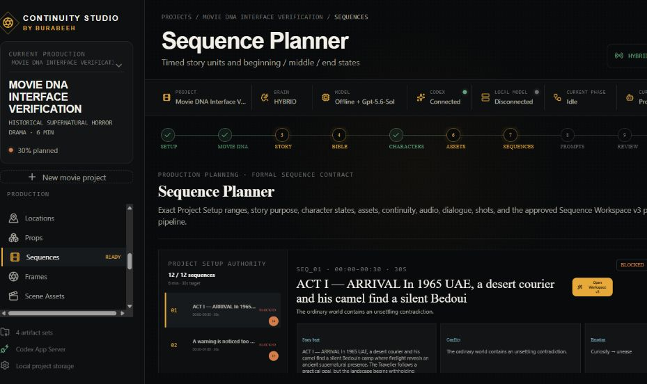 |
| JSON Prompt | 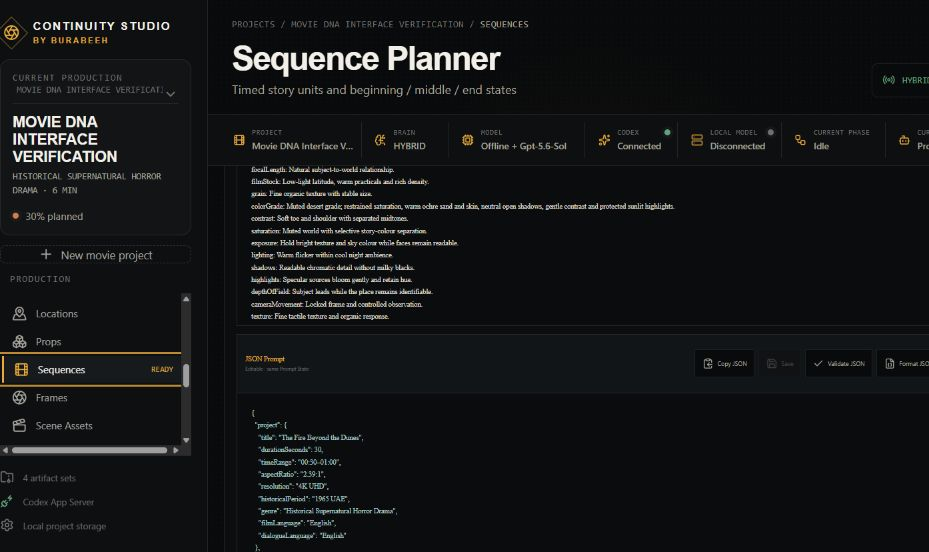 |
| Reference Package | 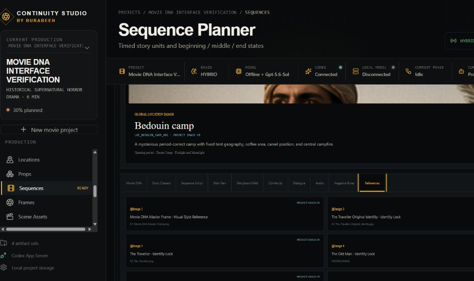 |

Browse the [complete 57-image screenshot gallery](docs/SCREENSHOTS.md).

## Install

### Windows installer or portable app

Download the current installer or portable executable from [GitHub Releases](https://github.com/momorzq-oss/Continuity-Studio/releases). Windows packages are currently unsigned, so Microsoft Defender SmartScreen may display the standard unknown-publisher warning.

### Install from source

Requirements: Node.js 20.19 or newer (Node.js 22 LTS recommended), npm 10 or newer, and Git when cloning.

```bash
git clone https://github.com/momorzq-oss/Continuity-Studio.git
cd Continuity-Studio
npm run setup
npm run desktop:dev
```

The CLI setup prompts support English, Arabic, Spanish, and Chinese:

```bash
npm run setup -- --lang en
npm run setup -- --lang ar
npm run setup -- --lang es
npm run setup -- --lang zh
```

For non-interactive setup, append `--yes`. See [Installation](docs/INSTALLATION.md) for desktop, browser-development, production, and troubleshooting instructions.

## Quick tutorial

1. Create a project and choose **Full** for automatic phase execution or **Phases** for approval after each block.
2. Select the Movie DNA categories, review the Movie DNA Board, generate or select the master frame, then lock Movie DNA.
3. Create Story v2, inspect its structure/timeline/arcs, approve it, and lock the version you want downstream.
4. Build the Film Bible, analyze characters, upload the protected main-character source, and generate the required character sheets.
5. Review the Asset Manifest and Image Asset Library. Approve or version assets instead of silently replacing locked records.
6. Build Full Script v2, verify exact dialogue, then plan shots and timed sequences.
7. Open a sequence. Choose a Platform Profile, edit the Normal or JSON Prompt, validate, and save a prompt version.
8. Review `@Image` numbering and upload order, then download or copy the sequence reference package.
9. Generate the video in the provider's own product, import it into the same sequence, then approve, reject, or regenerate it with a recorded reason.
10. Lock the accepted attempt so its approved End State becomes the next sequence Start State. Rejected attempts never update permanent continuity.
11. Review the movie progress dashboard, then export the structured project ZIP.

## Provider status

| Provider or engine | v1.1.0 support | Credentials |
| --- | --- | --- |
| Built-in local engine | Working planning pipeline and deterministic PNG previsual renderer | None |
| Codex | Working optional production supervision through Codex App Server | ChatGPT/Codex sign-in |
| OpenAI API | Working optional text-phase provider | `OPENAI_API_KEY` |
| OpenAI-compatible local model | Working optional text provider | Local server configuration |
| Seedance | Versioned prompt profile, validation, `@Image` map, manual handoff | No direct video API |
| Higgsfield | Versioned prompt profile, reference package, manual handoff | No direct video API |
| MiniMax | Versioned prompt profile, reference package, manual handoff | No direct video API |
| Veo, Kling, Runway, Sora | Versioned prompt profiles and manual handoff | No direct video APIs |
| Custom | Editable provider profile and manual handoff | Depends on user configuration |

Provider names describe compatible prompt workflows. They do not imply sponsorship, endorsement, ownership, or an official partnership.

## Local storage and privacy

- Development projects are stored under `data/projects/` and are ignored by Git.
- Installed Windows projects are stored in the user's Documents/Continuity Studio area.
- Original reference files are copied into protected project storage and are not overwritten by generated derivatives.
- Secrets belong only in the ignored `.env` file or the app's credential flow.
- The repository does not require an external database, Python, or FFmpeg for v1.1.0.

## Documentation

- [Installation](docs/INSTALLATION.md) · [User Guide](docs/USER_GUIDE.md) · [Workflow](docs/WORKFLOW.md)
- [Screenshot Gallery](docs/SCREENSHOTS.md) · [Troubleshooting](docs/TROUBLESHOOTING.md) · [Roadmap](docs/ROADMAP.md)
- [Architecture](ARCHITECTURE.md) · [Detailed Architecture](docs/ARCHITECTURE.md)
- [Platform Profiles and Limitations](PLATFORMS.md) · [Provider Development](docs/PROVIDER_DEVELOPMENT.md)
- [Main Character Tutorial](docs/MAIN_CHARACTER_TUTORIAL.md) · [Asset Tutorial](docs/ASSET_TUTORIAL.md) · [Scene Tutorial](docs/SCENE_TUTORIAL.md)
- [Complete Movie Tutorial](docs/COMPLETE_MOVIE_TUTORIAL.md) · [AI Filmmaking Visual Guide Knowledge](docs/AI_FILMMAKING_VISUAL_GUIDE_KNOWLEDGE.md)
- [Narrated Tutorial Production](tutorial/README.md) · [Voiceover Script](tutorial/voiceover-script.txt) · [Tutorial Shot List](tutorial/tutorial-shot-list.md)
- [Languages](docs/LANGUAGES.md) · [About BURABEEH](docs/ABOUT_BURABEEH.md)
- [Contributing](CONTRIBUTING.md) · [Security](SECURITY.md) · [Code of Conduct](CODE_OF_CONDUCT.md)

## Development checks

```bash
npm run typecheck
npm test
npm run docs:check
npm run build
```

## License

Copyright 2026 Mohammed Al Marzooqi. Licensed under the [Apache License 2.0](LICENSE).
