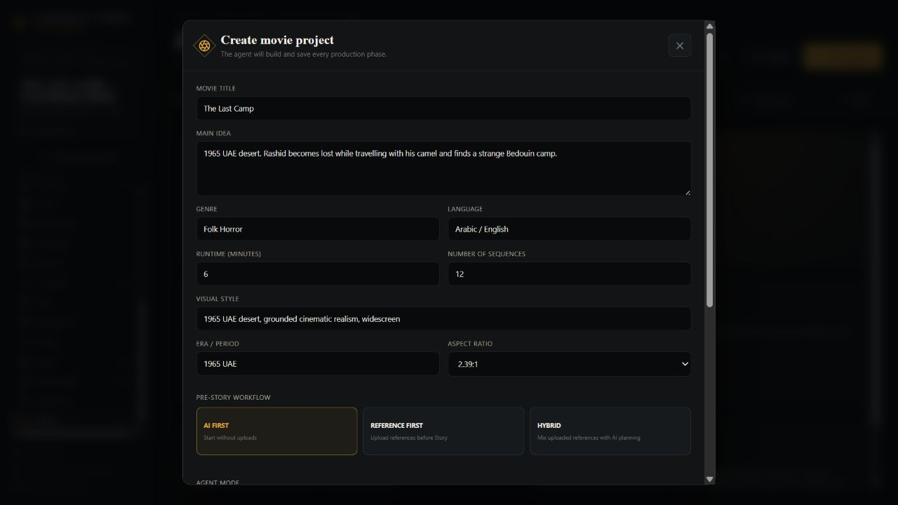
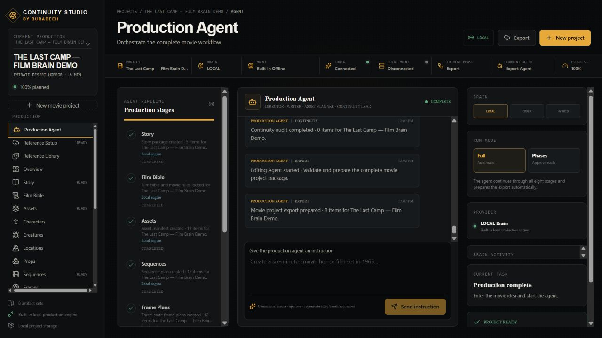
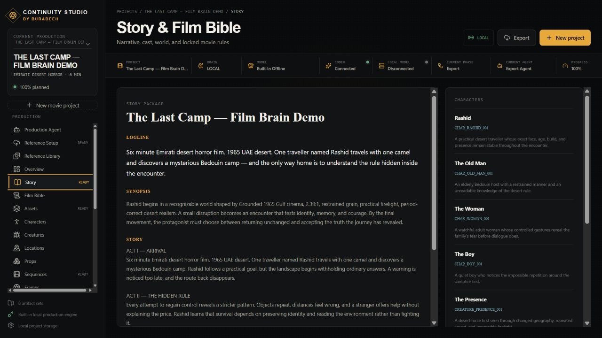
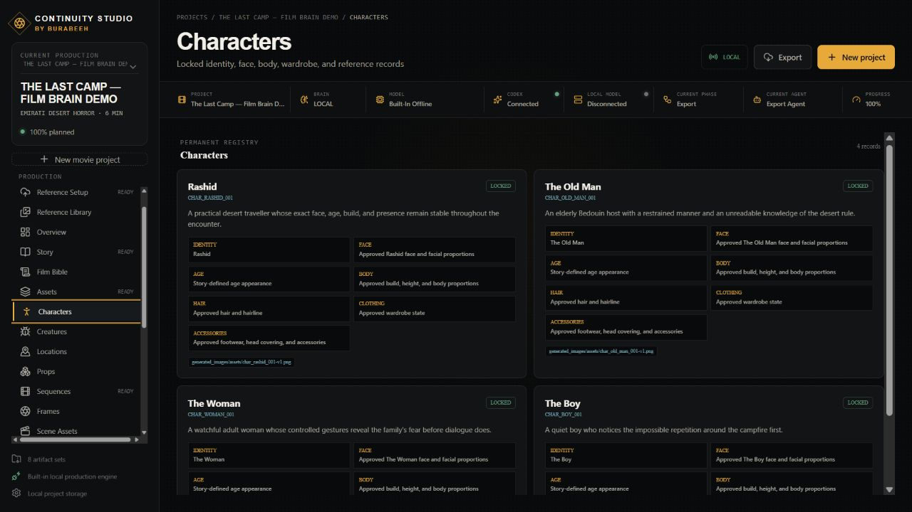
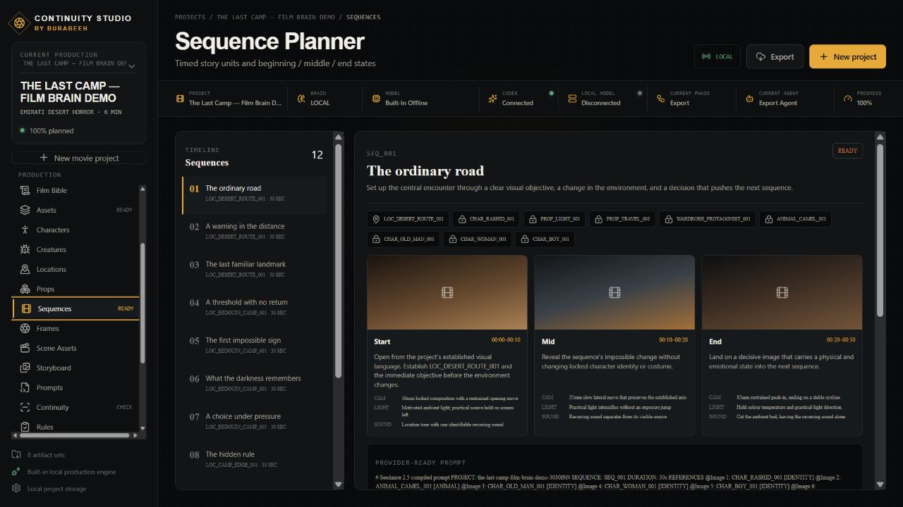
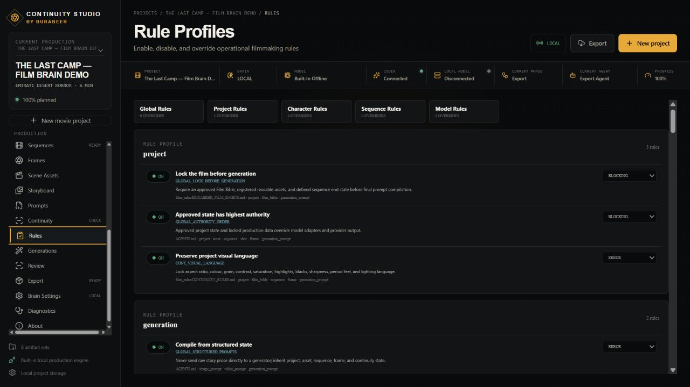
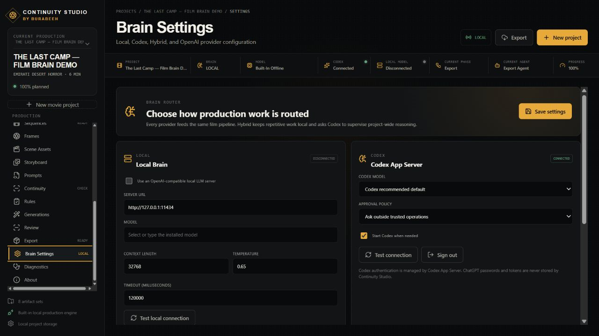
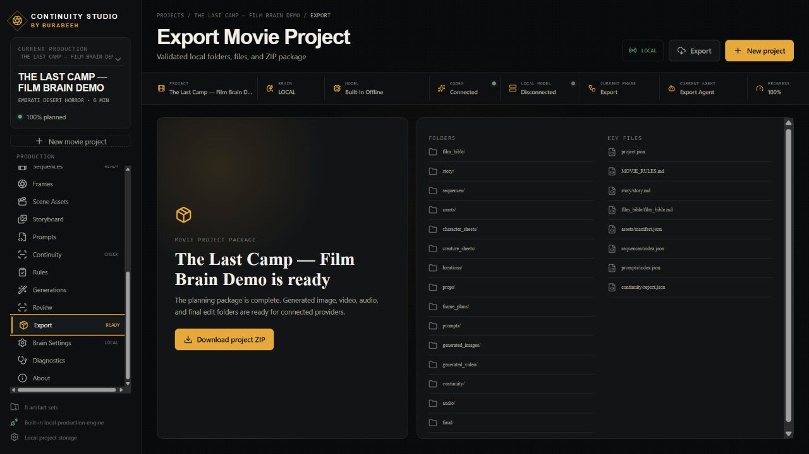
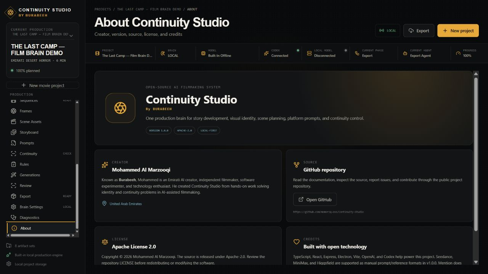

# Continuity Studio screenshot gallery

Every screenshot below comes from the fictional **The Last Camp — Film Brain Demo** project. No private uploads, credentials, or personal projects are included.

## Start and orchestration

## References, story, and assets

## Scenes and planning

## Compilation, review, and release

