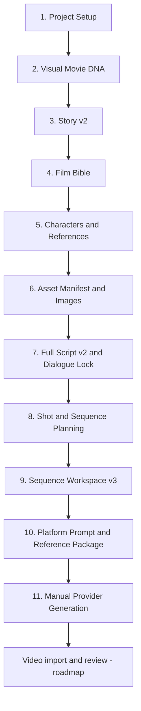

# Production Workflow

Continuity Studio By BURABEEH keeps every production block connected to approved upstream state. A downstream artifact is versioned or invalidated when its source changes; it is not silently treated as current.

## Choose a run mode

- **Automatic Movie** uses the existing production services through the restart-safe Automatic Production Director. One brief starts Movie DNA, Story, Film Bible, characters, numbered assets, production memory, Audio Bible, Full Script, dialogue locks, shots, sequences, Prompt States, reference mapping, and packages. It pauses at the protected Main Character checkpoint or a real **NEEDS USER REVIEW** condition.
- **Manual Guided Mode** starts with one simple movie brief. Studio Brain pre-fills Setup and Movie DNA, then waits at every stage for BACK, SAVE, NEXT, APPROVE AND NEXT, or LOCK AND NEXT. A persisted 14-stage bar removes the need to hunt through navigation tabs.
- **Full and Phases orchestration** remains compatible with existing projects and the Production Agent, while new Manual projects use the guided Phases behavior by default.

Automatic and Manual Guided modes share the same project schema and editable screens. Either mode can switch to the other without converting or restarting the project. Manual Mode saves its last incomplete step and offers **CONTINUE WHERE YOU LEFT OFF** after restart.

Both modes use the same project records and the same production services. Switching modes does not create a second project pipeline.

## Current v1.1.0 workflow

### 1. Project Setup

Define the idea, title, genre, era, runtime, sequence duration, aspect ratio, resolution, film/dialogue language, rating, target platform, narration, dialogue, music, subtitles, reference mode, and production mode. Runtime and sequence duration determine the exact planned sequence count.

### 2. Visual Movie DNA

Choose from 27 categories and 629 selectable directions. Review options visually, compare candidates, add a custom direction when necessary, and lock the approved version. The Movie DNA Master Frame and structured DNA remain separate but linked sources.

Platform limits do not belong in Movie DNA. Duration, reference counts, syntax, audio support, and other provider behavior live in versioned Platform Profiles.

### 3. Story v2

Create the story through AI First, Reference First, or Hybrid mode. Inspect Full Story, Story Structure, Timeline, Character Arcs, and Sequence Breakdown. Analyze edits before accepting downstream impact. Approve and lock the intended story version.

### 4. Film Bible

Generate world rules, tonal law, visual language, production design, character/location continuity, and permanent negatives from the approved Story and locked Movie DNA. Regeneration creates a new draft without silently replacing the approved version.

### 5. Characters and references

Reconcile story candidates to permanent IDs. Upload a protected main-character source, assign reference roles, inspect identity metadata, generate adaptive sheets, and record the character's per-sequence physical, costume, injury, prop, location, and emotional state.

### 6. Asset Manifest and images

Register every recurring character, creature, animal, vehicle, location, prop, and wardrobe item before use. Each asset has a stable ID, reference number, version, prompt, negative prompt, source links, lineage, approval, and lock state. Generate or upload the required images, then approve the correct versions.

### 7. Full Script v2 and dialogue lock

Review the Full Screenplay, Dialogue Only, Shot Script, Production Script, scenes, and sequences. Dialogue records have stable IDs and exact locked text. A dialogue change is analyzed and versioned before it updates sequence prompts.

### 8. Shot and sequence planning

Build timed sequences and shots with location, active assets, action, camera, lens, composition, lighting, sound, dialogue, START/MID/END state, and continuity requirements. The prior approved ending is the intended source for the next start.

### 9. Sequence Workspace v3

Open a sequence from the planner. Use Previous/Next navigation and inspect:

- canonical Prompt State;
- editable Normal Prompt;
- editable synchronized JSON Prompt;
- locked Movie DNA and global location;
- Story, script, shot, dialogue, audio, and continuity context;
- optional nine-panel Storyboard Grid;
- prompt validation, manual overrides, and saved versions.

### 10. Platform prompt and reference package

Choose Seedance, Higgsfield, MiniMax, Veo, Kling, Runway, Sora, or Custom. The compiler applies that versioned profile, maps stable assets to temporary provider slots such as `@Image 1`, validates real limits, and produces an upload order and sequence reference package. Critical references are not silently discarded.

### 11. Manual provider generation

Copy the Normal or JSON Prompt and upload the numbered references in the provider's own product. The current source build does not claim direct provider video generation.

### 12. Generated-video return and review

Import the provider result into the same sequence. Continuity Studio records its platform, prompt and JSON versions, reference set, attempt number, generation date, filename, and duration. Approve, reject, or lock the result. Rejection preserves the attempt and reason. An approved locked ending updates permanent continuity and becomes the next sequence Start State.

### 13. Dashboard and export

Review total, approved, ready, blocked, rejected, and waiting sequences together with missing assets, prompt warnings, and continuity warnings. When every sequence is approved or locked, download the complete structured project ZIP.

## Approval and invalidation rules

- Drafts can change without becoming permanent production truth.
- Approved records can be used downstream.
- Locked records require an explicit new version instead of silent replacement.
- Upstream changes create visible stale/changed state downstream.
- Rejected future video attempts must never update permanent continuity.

See [Roadmap](ROADMAP.md) for automated visual inspection, targeted prompt correction, direct provider adapters, and final movie assembly.
